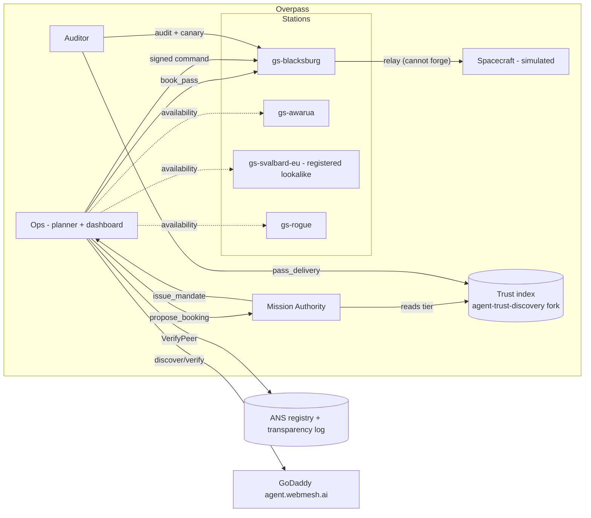

# Overpass

Multi-agent broker for satellite ground station passes, built for VTHacks 14.
A booking gives a station time-boxed authority to relay commands, and Agent
Name Service (ANS) verification gates every step. Design: `docs/master-plan.md`.
Progress and per-phase status: `PROGRESS.md`.

## Architecture



Ops finds and verifies stations through ANS, the authority signs a mandate only
if the flight rules and the station's trust tier allow it, the station relays
Ops-signed commands to the (simulated) spacecraft without being able to forge or
replay them, and the auditor scores behavior back into the trust index. One
binary plays every role: `--role ops|authority|station|auditor|spacecraft`.

## Quick start

Needs Go 1.26+ (matches the vendored trust-index fork), `make`, `curl`, and a C
toolchain for `go test -race` (Xcode command line tools on macOS).

```sh
make build        # bin/agent
make test         # go test -race ./...
make lint         # gofmt + go vet
make run-local    # ops on :8443, gs-blacksburg station on :8444; Ctrl-C stops both
make smoke        # in a second terminal: /health and /events checks
make accept       # every scripts/accept/phase-N.sh in order
```

Local agents make a throwaway self-signed cert in memory, so use `curl -k`:

```sh
curl -k https://localhost:8443/health
curl -kN https://localhost:8443/events    # server-sent events, starts with agent_started
```

## Running one agent

```sh
bin/agent --config configs/local/ops.yaml [--role ops|authority|station|auditor|spacecraft]
```

Config is one YAML file per agent: `role`, `host`, `port`, `public_url`, `cert.{cert_file,key_file}` (TLS),
`identity.{key_file,chain_file}` (ANS identity key and chain), `card.{version,display_name,description,
org_name,org_url,agent_id,receipt_file,tl_agent_url,dns_aid,tier2,skills}`, `peers[{name,url}]`,
`trust_roots`, `registry_url`, `log_url`. Anything left out of `card` is left out of the served files.
Unknown fields are rejected. Environment overrides: `OVERPASS_ROLE`,
`OVERPASS_HOST`, `OVERPASS_PORT`, `OVERPASS_CERT_FILE`, `OVERPASS_KEY_FILE`,
`OVERPASS_REGISTRY_URL`, `OVERPASS_LOG_URL`. Keys and certs live under `certs/`,
which is gitignored.

## Endpoints

| Path | Method | Returns |
| --- | --- | --- |
| `/` | POST | A2A JSON-RPC 2.0: `SendMessage` (A2A 1.0) and `message/send` (0.3) |
| `/` | GET | accessible HTML page about the agent |
| `/.well-known/agent-card.json` | GET | A2A agent card, signed (detached JWS, ES256, `typ agent-card+jws`, `jku` = own trust card) |
| `/.well-known/ans/trust-card.json` | GET | ANS trust card: EC P-256 key with `x5c` |
| `/health` | GET | `{"status":"ok","a2aProtocolVersion":"1.0",...}` |
| `/.well-known/{jwks,did,ard,ai-catalog}.json`, `/robots.txt`, `/llms.txt` | GET | tier 2; `card.tier2: false` turns them off |
| `/events` | GET | `text/event-stream` of `{ts,agent,kind,subject,result,reason,data}`; honors `Last-Event-ID` |

**Calling a skill.** Send a message whose data part is `{"skill": "<id>", ...args}`.
A message without one gets a text reply listing the skills. Rejections are JSON-RPC
`-32602` with a `google.rpc.ErrorInfo` whose `reason` is the `internal/errs` code.

**Security by role** (the card is generated from what is mounted):
- **station:** DPoP (ans-sdk-go `pop`) on every A2A call, plus a mandate on `book_pass`.
- **authority:** DPoP.
- **ops, auditor, spacecraft:** `noAuth`.

DPoP needs the transparency log's root keys in `trust_roots` (C2SP strings). With none,
every inbound call gets `401 CALLER_REJECTED` (fail closed).

**Card hash.** `bin/cardhash [-k] <card URL>` prints the SHA-256 to compare with the
registered `metaDataHash`. Cards are served in JCS form, so the raw and JCS hashes agree.

Every rejection is JSON `{"code":...,"detail":...}` with a code from `internal/errs`.

## Verification (`internal/verify`)

`Verifier.VerifyPeer(ctx, host)` runs eight checks, emits one bus event per check, and fails closed:

| Check | What passes |
| --- | --- |
| `registered` | `_ans-badge` TXT points at this environment's log, and the badge is for this host |
| `badge` | badge status ACTIVE (WARNING or DEPRECATED is a warning) |
| `scitt_receipt` | the receipt verifies against the log's root keys |
| `status_token` | the token verifies, is for this agent and host, and is ACTIVE; a fetch error passes for 10 min on the last good token |
| `cert_chain` | the server leaf the peer presents is attested in the status token and covers the host |
| `tlsa` | DANE `_443._tcp` matches (no record is a warning) |
| `card_hash` | the served card's SHA-256 equals the registered `metaDataHash` |
| `card_signature` | the card verifies with the trust-card key at a pinned `jku`, and its `x5c` leaf is an attested identity cert |

**Other pieces:**
- `FindByTag` uses the ANS Finder.
- `Outbound.Attach` signs outbound requests with DPoP and adds SCITT headers.
- `internal/webmesh` asks agent.webmesh.ai's MCP `verify_agent` tool for its verdict.
- Environments (production and a local stack) and peers are listed in config under
  `environments` and `peers[{name,url,env,dial}]`.

## Passes and planner

```sh
bin/passes                               # tonight's passes (next 24 h) for the configured satellite
bin/passes -start 2026-09-20T00:00:00Z   # a fixed window (matches internal/passes/testdata/golden-passes.txt)
bin/passes -demo-pass -json              # the next real pass replayed in a 90 s window starting now
bin/passes -refresh-tle                  # fetch the current TLE from CelesTrak (only when asked)
```

- **Prediction.** `internal/passes` propagates with SGP4 (go-satellite) on a WGS84 observer:
  10 s steps, AOS and LOS refined to 1 s, a 10° mask, and passes under 60 s dropped.
  It was cross-checked against skyfield: 22 of 22 passes agree within 1 s.
- **Planning.** `internal/planner` ranks passes by
  `score = 100·max_el + 100·bonus − points_per_dollar·cents`. It schedules greedily without
  overlaps and only on verified stations whose tier allows the mode. `Replan` emits a
  before-and-after diff.

## Booking (quote, mandate, book)

- **Station `get_pass_quote {norad_id, aos, los, mode, max_elevation_deg}`.**
  - Returns a Quote priced at `per_minute_cents` × whole minutes.
  - It carries an x402 `accepts` block whose `payTo` equals the card's `x-payment.payTo`.
  - It's valid for 10 minutes.
- **Authority `issue_mandate {quote, command_classes?}`.**
  - The caller must be in `ops_agents`, and the station must pass VerifyPeer and meet its tier
    (uplink needs FIDUCIARY) and the `flight_rules`.
  - Returns an `overpass-mandate+jws` bound to the caller's DPoP key.
  - Refusals are `POLICY_REFUSED:<rule>`.
- **Station `book_pass {quote_id, mandate}`.**
  - Runs master plan 8.5's checks in order, each with its own code.
  - Books with the overlap check and nonce consumption in one SQLite transaction.
  - Returns a station-signed `overpass-receipt+jws`.
- **Satellite registry.** `bin/satreg sign|pubkey` signs the registry that stations pin
  (`satreg.file`, `satreg.signer_key_file`).

## Pass session

- **Station `relay_command {booking_id, command}`.**
  - It's open from the mandate's `nbf − 30 s` to `exp + 30 s`; outside that it's `WINDOW_CLOSED`.
  - It checks DPoP key = the mandate's `jkt`, typ, class in `command_classes` (else
    `CLASS_REJECTED`), and `mandate_id`.
  - It relays the Ops-signed command, untouched, to the spacecraft agent (`uplink`), appends the
    CommandRecord, and returns the spacecraft's Ack.
- **Station `session_evidence {booking_id}`.** Returns the chain head, records, Acks, and suspected
  drops.
- **Spacecraft (`role: spacecraft`).** Accepts only Ops-signed `overpass-cmd+jws` commands for its
  NORAD ID with a strictly greater counter, which is persisted.
- **Token loop.** Both sides check the other's status token every 30 s:
  - a token that isn't ACTIVE cuts the session (`SESSION_CUT:revoked`)
  - a newest token older than 10 min cuts it (`SESSION_CUT:token_stale`)
  - a failed fetch alone only warns

  On a cut, Ops discards queued commands and replans.

## Attack battery and auditor

```sh
bin/battery run    -config deploy/local/battery-honest.yaml           # 23 checks, exits 0 if all BLOCKED
bin/battery run    -config deploy/local/battery-rogue.yaml -expect-vulnerable
bin/battery <name> -config deploy/local/battery-honest.yaml           # one attack
bin/battery canary -config deploy/local/battery-honest.yaml           # the two auditor probes
```

- **`internal/battery`** runs every attack in master plan section 10 (the 12-row table, the 3
  probes, and the Overpass-only checks) against a station over A2A, reporting BLOCKED, VULNERABLE
  or INCONCLUSIVE with the code observed. It gates a deploy: `AllBlocked` must hold for an honest
  station.
- **`internal/auditor`** audits a finished pass (re-verify identity, mandate, receipt, chain heads,
  missing acks; sign an `overpass-audit+jws`) and runs canary probes a correct station rejects; an
  acceptance is `CANARY_ACCEPTED`. Results go to a `TrustSink` (Phase 8).
- **Adversary profiles:** `deploy/local/` (honest, rogue, impostor, lookalike). See its README.

## Local ANS stack

```sh
git clone https://github.com/agentnameservice/ans.git ../ans
scripts/local-ans.sh start            # RA :18080, log :18081, Finder :18082, DNS :15353
scripts/local-ans.sh env              # environment block (with root key) for a config
scripts/local-register.sh gs-blacksburg.localhost 0.1.0 certs/local/gs-blacksburg configs/local/station-ans.yaml
bin/agent --config configs/local/station-ans.yaml
scripts/local-ans.sh stop
```

`scripts/accept/phase-3.sh` does all of this and runs the checks.

**Registering on production is a human step:**
- `scripts/register.sh <host>` only prints the plan. Each step needs `--step <step>`
  and `--i-am-a-human-and-this-is-permanent`.
- `scripts/dns-records.sh` prints the DNS records to create.

## How verification works

Before Ops trusts a station it runs `VerifyPeer` (`internal/verify`), which checks,
in order: the ANS **badge** (registered + ACTIVE in the transparency log), the
**identity cert** chain, the **DANE/TLSA** record equals the SHA-256 of the cert
actually served on :443 (needs DNSSEC), the **SCITT receipt**, and the signed
**agent card** — whose `jku` we resolve ourselves and pin to the ANS-verified
host, requiring the card's `x5c` leaf to match the attested identity cert (this
closes `jku` injection). GoDaddy's own `agent.webmesh.ai` verifies our stations
live, and we verify them. Run one check from a script:

```sh
bin/agent --config <cfg> --verify gs-blacksburg.blacksburgbytes.club   # read-only
scripts/smoke.sh blacksburgbytes.club                                   # all hosts, read-only
```

## Trust and tiers

Identity is not authorization. A forked `agent-trust-discovery` index scores each
agent on five dimensions; Overpass's authority gates access on the **truthful**
trust vector in its `flight_rules` — availability (verified), downlink (integrity
≥ 50, no audit failures), uplink (integrity ≥ 80, behavior ≥ 80, ≥ 3 audited
passes). Our added `pass_delivery` behavior signal is fed by the auditor. A
registered lookalike passes every identity check but, with no audited history,
stays READ_ONLY. `make trust-up` runs the index locally; see
`docs/status/phase-8.md`.

## Dashboard and the LLM planner

The Ops agent serves a framework-free, keyboard- and screen-reader-first
dashboard at `/ui/` (axe-clean; `docs/a11y-manual.md`). An LLM planner
(`internal/llmplan`) proposes bookings through tools, but `propose_booking` only
forwards to the authority — **policy, not the model, holds authority** — and
station free text never reaches the prompt. It falls back to the greedy plan on
any error or a 10s timeout. Set `ANTHROPIC_API_KEY` to enable it.

## Deploy and preflight

```sh
make preflight               # tests + honest-station battery + local smoke; gates a deploy
make lint                    # gofmt + go vet + scripts/secret-scan.sh (no keys/certs committed)
sudo deploy/install.sh --dry-run   # prints every action, changes nothing
scripts/demo.sh              # cold start to the dashboard; prints the revoke command (never runs it)
```

Production bring-up (buy/register/DNS/VPS and the live revoke beat) is human work
by design — full step-by-step in `docs/deploy-runbook.md`; the 3-minute demo in
`docs/demo-runbook.md`; submission draft in `docs/devpost.md`.

## Honest limits

- The **spacecraft and the RF link are simulated** — no real radio, no real bus.
  The spacecraft is an internal process with **no public ANS identity** (not registered).
- **No on-chain settlement**; x402 payment options are described, not executed.
- Trust observations are **seeded** for the demo (behavior only, marked as seed
  data). We never fabricate identity or integrity scores.
- We **run our own trust index and auditor**; in production a neutral party would.
- Local identity uses demo-CA (DV) certs, so the index's own FIDUCIARY tier isn't
  reachable locally; Overpass gates on the truthful vector instead.

## Layout

`cmd/agent` (the one binary), `cmd/battery` (attack battery, later),
`internal/{config,errs,bus}` (agent plumbing), `internal/{a2a,wellknown}` (A2A server, identity files), `cmd/cardhash`, `internal/{jose,schema,chain}`
(wire formats and crypto; see `docs/schemas.md`, frozen after Phase 1),
`internal/{wellknown,a2a,verify,mandate,passes,planner,session}` (later phases),
`web/` dashboard, `deploy/`, `scripts/accept/` per-phase acceptance,
`docs/plans/` and `docs/status/`.
